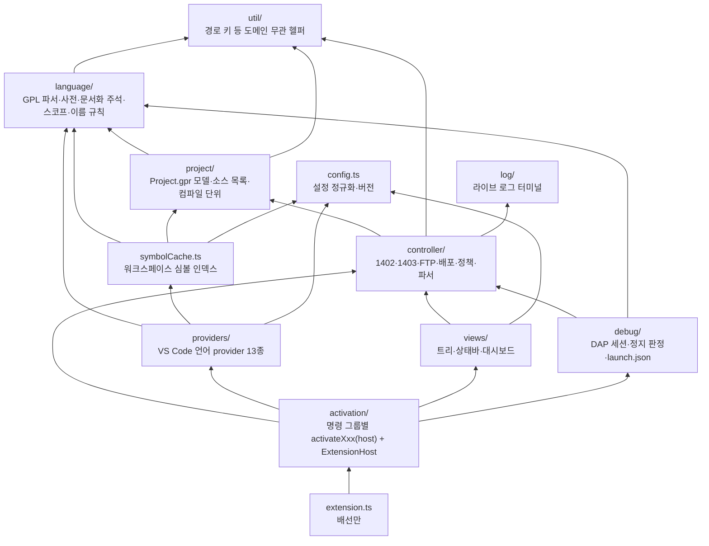

# 아키텍처 — 폴더가 계층을 말한다

> 이 문서는 **어디에 무엇을 두는가**와 **무엇이 무엇을 import 해도 되는가**의 정본이다.
> 같은 규칙을 `src/test/architecture.test.ts` 가 소스 트리를 읽어 검사하므로, `npm test` 가 통과하면
> 여기 적힌 구조가 실제 코드와 일치한다. 규칙을 바꾸려면 **테스트와 이 문서를 함께** 고친다.
> (2026-09-07 §1-DB 에서 정리. 세션별 변경 이력은 `docs/ai-handoff.md`, 파일별 한 줄 설명은 그 §4.)

## 1. 한 장 요약

확장은 두 축으로 나뉜다. **언어 축**(GPL 소스를 읽어 정의·참조·호버·완성을 만든다)과 **제어기 축**
(1402 명령 콘솔·1403 런타임 스트림·FTP 로 PA 제어기를 조작한다). 두 축 모두 **순수 계층**(vscode 를 모르는
Node 모듈)과 **접착 계층**(VS Code API 를 쓰는 모듈)으로 갈라진다. 순수 계층은 `npm test` 의 Node 단독
러너가 검증하고, 접착 계층은 Extension Development Host(F5)에서 사람이 확인한다.

화살표는 "import 해도 되는 방향"이다. **아래 계층은 위 계층을 모른다** — `language/` 가 `controller/` 를,
`controller/` 가 `views/` 나 `activation/` 을 import 하면 테스트가 실패한다.

## 2. 계층 규칙

| 계층(폴더) | 역할 | import 가능 | vscode |
| --- | --- | --- | --- |
| `util/` | 어느 도메인에도 속하지 않는 순수 헬퍼 (`pathKey`) | — | 금지 |
| `language/` | GPL 언어 분석 전부 — 파서·문 사전·GPL Dictionary 데이터/조회·문서화 주석·스코프·이름 바꾸기 규칙·식별자 규칙 | `util` | **금지** (11+6 모듈 전부 순수) |
| `project/` | Project.gpr 모델 — 소스 목록·라이브러리 해석·컴파일 단위·소스 승격·.gpr 동기화 순수 로직 | `language`, `util` | 허용 목록 2개만 (`projectFileScope`·`promoteSourceCommand`) |
| `log/` | 1402/1403 트래픽 미러 터미널 | — | 허용 (단일 파일) |
| `config.ts` | 설정 값 정규화 단일 출처, `EXTENSION_VERSION` | `language` | 허용 |
| `controller/` | 제어기 축 — 소켓·명령 정책·응답 파서·배포 파이프라인·잠금·중단점·상태 판정·AI 정책 | `project`, `util`, `log` | 허용 목록 9개만 (아래 §3) |
| `symbolCache.ts` | 워크스페이스 심볼 인덱스 — providers 와 activation 이 공유하는 언어 서비스 호스트 | `language`, `project`, `util`, `config` | 허용 |
| `debug/` | DAP 어댑터(`gplDebugSession`)·구성 provider·정지/스텝 판정·launch.json 편집 | `controller`, `project`, `language`, `util` | 허용 목록 2개만 |
| `views/` | 트리·상태바·대시보드와 그 표시 규칙 | `controller`, `util`, `config` | 허용 목록 3개만 |
| `providers/` | VS Code 언어 provider 구현 13종 | `language`, `project`, `util`, `config`, `symbolCache` | 전부 허용(접착 계층) |
| `ai/` | AI 에이전트 설정 내보내기 | — | 허용 (단일 파일) |
| `activation/` | 명령 그룹별 `activateXxx(host)` 14개 + `ExtensionHost` + 공용 제어기 조작(`controllerOps`) | 위 전부 | 전부 허용(접착 계층) |
| `extension.ts` | `activate()`/`deactivate()` — 배선만(195줄) | 전부 | 허용 |
| `test/` | Node 단독 러너(`harness.ts`) + 순수 모듈 테스트 + 구조 테스트 | 전부 | **금지** (러너가 vscode 없이 돈다) |

같은 계층 안의 import 는 항상 허용된다. `import type` 도 방향 규칙을 따른다(설계상의 의존이므로) —
단 **런타임 순환 금지** 규칙(R3)에서는 지워지는 `import type` 을 제외한다.

## 3. vscode 를 import 해도 되는 순수-계층 모듈 (허용 목록)

접착 계층(`activation/`·`providers/`) 밖에서 vscode 를 쓰는 모듈은 아래와 **정확히 일치**해야 한다.
새로 넣으려면 여기와 `architecture.test.ts` 의 `VSCODE_ALLOWED_MODULES` 에 함께 적는다.

| 모듈 | 왜 vscode 가 필요한가 |
| --- | --- |
| `controller/controllerConnection` | 설정 읽기(`workspace.getConfiguration`)·Output 채널 — 순수 소켓 계층은 `consoleSocket` 에 있다 |
| `controller/runtimeConsole` | 1403 스트림의 Output 채널·Disposable — 재연결 상태 머신 분리는 로드맵 Phase 3 |
| `controller/deployService` | 배포 파이프라인이 Problems(DiagnosticCollection)·Output 을 직접 받는다 — 결과 보고부는 `deployOutcome`(순수)로 분리됨 |
| `controller/deployRecord` | `deployRecordCore`(순수)의 Memento 래퍼 |
| `controller/debugBridge` | 디버그 세션 ↔ 확장 이벤트 버스(`EventEmitter`) |
| `controller/breakpointSync` · `breakpointMirror` | 에디터 중단점(`debug.breakpoints`) 양방향 동기화 — 계획 계산은 `breakpointReconcile`(순수) |
| `controller/projectPicker` · `gprSyncCommand` | QuickPick·WorkspaceEdit 를 쓰는 명령 래퍼 — 규칙은 `projectPickerCore`·`project/gprSync`(순수) |
| `debug/gplDebugSession` · `activateDebug` | DAP 세션 자체(`vscode.debug`)·구성 provider |
| `project/projectFileScope` · `promoteSourceCommand` | `workspace.findFiles`·명령 등록 |
| `views/*` 3개 | TreeDataProvider·StatusBarItem·WebviewPanel — 표시 규칙은 `treeFormat`·`runtimeConsoleTreePresentation`·`refreshThrottle`(순수) |
| `ai/exportAgentSetup` · `log/liveLogTerminal` | 파일 대화상자·터미널 |
| `config` · `symbolCache` · `extension` | 루트 모듈 |

원칙: **판단은 순수 모듈에, vscode 호출은 얇은 래퍼에.** 새 기능을 넣을 때 "이 판단을 Node 단독 테스트로
고정할 수 있는가"를 먼저 묻고, 그렇다면 순수 모듈로 쓴 뒤 접착 계층에서 부른다(예: `startCommand`·
`commandPolicy`·`breakpointReconcile`·`deployOutcome`).

### 3.1 제어기 조작은 "절차"를 모듈로 (주입형 IO)

제어기(1402)의 원시 명령은 **안전한 단위가 아니다.** 예를 들어 `Stop -all` 은 정지 *요청 접수*까지만 보장하고
(§0.6), 실제 정지는 `Show Thread` 폴링으로 확인해야 하며, `-752` 는 실패가 아니라 진행 중이고, 안 멈추면
재시도해야 한다. 즉 **"프로그램을 멈춘다"는 한 동작 = 전송 + STATUS 판정 + 확인 폴링 + 재시도 + 실패 처리** 전부다.

그래서 이런 절차는 호출부에서 조립하지 않고 `controller/` 의 순수 모듈에 **절차째로** 둔다. 호출부가 다른 것은
전송 수단과 로그 목적지뿐이므로 그것만 IO 인터페이스로 주입한다(`send`/`log`/`sleep`/`isCancelled`/`now`).
그러면 ① 가짜 IO 로 시나리오를 Node 단독 테스트에 고정할 수 있고 ② 판정 규칙이 바뀌어도 한 곳만 고치면 되며
③ 새 호출부가 안전장치를 빠뜨릴 수 없다(실제로 디버그 세션의 attach preflight 는 정지 확인이 빠져 있었다).

정본: `controller/threadStop.ts`(전체·개별 쓰레드 정지) · `controller/projectCommands.ts`(Compile/Load/Unload/Start) ·
`controller/remoteProjectPath.ts`(어느 원격 사본을 대상으로 삼을지). 결과는 성공/실패 불리언이 아니라 **구조화된 결과**로
돌려주고, 특히 "확인하지 못함"(`unconfirmed`)을 성공과 구분해 드러낸다 — 배포는 통과시키고 원격 파일 삭제는
중단하는 식으로 **정책은 호출부가 고른다.** 같은 꼴로 정리할 다음 후보(`Show Thread` 열거·중단점 명령 폴백·busy 재시도·스택 조회)는
`docs/ai-handoff.md` §1-DD 의 표와 §1-DE 말미에 있다.

### 3.2 용어 — 이 구조를 부르는 표준 이름

여기서 한 일에는 업계 표준 명칭이 있다. 검색·문서화·외부 자료 대조를 위해 **영문 원어를 함께** 적어 둔다
(한국어 번역이 갈리는 항목은 아래에 표기했다).

| 영문 | 한국어 | 이 저장소에서 무엇을 가리키나 |
| --- | --- | --- |
| Anti-Corruption Layer (ACL) | 손상 방지 계층 | 제어기(1402)의 부실한 원시 명령을 우리 도메인 언어로 감싸는 `controller/` 절차 모듈들. **§3.1 이 말하는 것이 이것이다** |
| Facade pattern | 퍼사드 패턴 | 여러 단계(전송·판정·폴링·재시도)를 호출 하나로 감춘 형태 |
| Dependency Injection (DI) | 의존성 주입 | `send`/`log`/`sleep` 을 호출부가 넣어 주는 IO 인터페이스 |
| Ports and Adapters / Hexagonal Architecture | 포트와 어댑터 / 육각형 아키텍처 | 순수 계층(포트) ↔ vscode·소켓 접착(어댑터)의 분리 — §2 계층표 전체 |
| Humble Object pattern | 험블 오브젝트 패턴 | vscode 의존을 테스트 불가능한 얇은 껍질로 몰아내는 방식(`deployService` 의 UI 부분) |
| Single Source of Truth (SSOT) | 단일 진실 공급원 | "정본" 이라고 쓰는 것 — 판정 규칙이 사는 단 한 곳 |
| Don't Repeat Yourself (DRY) | 중복 배제 원칙 | 위를 요구하는 원칙 |
| Consolidation refactoring | 통합 리팩터링 | 흩어진 사본을 정본 하나로 모으는 작업 자체(§1-DD·§1-DE) |
| Implementation drift | 구현 편차 | 사본들이 시간이 지나며 조금씩 달라진 상태 — "이 기능 저 기능이 다르게 동작한다"의 정체 |
| Mechanism / policy separation | 메커니즘과 정책의 분리 | 모듈은 관측 결과(`unconfirmed` 등)만 돌려주고, 그걸로 무엇을 할지는 호출부가 정하는 규약 |

> **번역이 갈리는 항목**: Anti-Corruption Layer 는 Microsoft Learn 이 **손상 방지 계층**, 에릭 에반스 DDD
> 번역서 계열이 **부패 방지 계층**을 쓴다. 이 저장소는 **손상 방지 계층**으로 통일한다.
> Single Source of Truth 도 *단일 진실 원천*·*단일 정보원* 표기가 있으나 위 표기를 쓴다.

## 4. 조립 — extension.ts → ExtensionHost → activation/*

- `extension.ts` 는 `ExtensionHost` 를 만들고 `activateXxx(host)` 를 **종전 순서대로** 부른다. 순서가 뜻을
  갖는 지점은 그 파일 머리말에 있다(트리·프로젝트 컨텍스트가 먼저, 언어 기능 마무리는 맨 끝).
- `activation/host.ts` 의 `ExtensionHost` 는 종전 5,300줄 클로저가 공유하던 것을 명시적으로 담는다:
  서비스(불변) · 가변 상태(항상 `host.x` 로 읽는다) · 두 그룹 이상이 쓰는 헬퍼 · 하위 API(`project`·`connection`·
  `deploy`·`decorations`). 새 명령은 해당 그룹 파일에 추가하고, 그룹이 없으면 `activateXxx(host)` 하나를 더 만든다.
- 명령 ID·설정 키는 `package.json` 이 정본이다. 구조 테스트 R5/R6 이 "선언됐는데 등록 안 됨", "코드가 읽는데
  선언 안 됨"을 잡는다. 명령 ID 를 상수로 두는 경우(`GPR_SYNC_COMMAND` 등)도 인식한다.

## 5. 어디에 무엇을 두나 (판단 기준)

| 넣으려는 것 | 위치 |
| --- | --- |
| GPL 문법·의미 규칙(파싱, 스코프, 문서화 주석, 이름 규칙, 사전 데이터) | `language/` — vscode 금지 |
| Project.gpr·소스 파일 목록·프로젝트 경계 | `project/` |
| 1402/1403/FTP 프로토콜, 응답 파서, 명령 정책, 배포 단계 판정, 상태 코드 | `controller/` (순수로 쓸 수 있으면 순수로) |
| DAP 요청 처리, 정지/스텝 판정 | `debug/` |
| 트리/상태바/대시보드에 **어떻게 보이는가** | `views/` — 문구·아이콘 규칙은 순수 모듈로 |
| VS Code provider(hover·completion…) | `providers/` — 판단은 `language/`·`symbolCache` 에서 가져온다 |
| 명령 등록, 알림, QuickPick, 설정 읽기 | `activation/` |
| 어느 도메인에도 속하지 않는 헬퍼 | `util/` (도메인 규칙은 넣지 않는다) |
| 설정 값 정규화 | `config.ts` (`pickOption` 패턴 — 허용값 목록 하나로 기본값·정규화를 같이 관리) |

파일 스타일: `.ts` 는 폴더마다 탭(activation·views·controller 일부)과 공백 4칸이 섞여 있다. **이웃 파일을 따른다.**
저장소 EOL 은 LF 지만 `core.autocrlf=true` 라 작업 트리엔 CRLF 파일이 섞여 있다 — 스크립트로 고칠 때는
파일별 EOL 을 보존한다(`.editorconfig` 참조).

## 6. 테스트 전략

- **러너**: `src/test/harness.ts`(의존성 0) + `src/test/index.ts`(수동 등록). `npm test` = `tsc` + `node out/test/index.js`.
  새 테스트 파일은 `index.ts` 에 한 줄 import — 잊으면 구조 테스트 R4 가 실패한다.
- **대상**: 순수 모듈 전부(2026-09-07 기준 820건). vscode 를 import 하는 모듈은 이 러너로 못 돈다 — 그래서
  판단 로직을 순수 모듈로 빼는 것이 곧 테스트 가능성이다.
- **구조 테스트** `architecture.test.ts` (6건): R1 vscode 허용 목록 · R2 계층 방향 · R3 런타임 순환 · R4 테스트 등록 ·
  R5 package.json↔명령 · R6 package.json↔설정 키. 실패 메시지가 위반 목록을 그대로 보여 준다.
- **컴파일러 게이트**(tsconfig): `strict` + `noUnusedLocals` · `noUnusedParameters` · `noImplicitReturns` ·
  `noImplicitOverride` · `noFallthroughCasesInSwitch`. 쓰지 않는 매개변수는 `_` 접두.
- **하드웨어 검증이 필요한 것**은 코드로 강제하지 않고 `docs/ai-handoff.md` §3 체크리스트로 남긴다(하드 규칙 6).

## 7. 알고 있는 부채 (2026-09-07)

| 항목 | 크기 | 상태 |
| --- | --- | --- |
| `debug/gplDebugSession.ts` | 5,187줄, 클래스 1개, 생성자 987줄 | DAP + 제어기 동작이 한 클래스 — 분해는 실기기 검증 필요(로드맵 P8) |
| `controller/deployService.ts` `deployLocked` | 1,100줄 함수 | 배포 파이프라인 단계 분리는 하드웨어 영향(로드맵 P9) |
| `controller/runtimeConsole.ts` | 1,260줄 | 재연결 상태 머신 → 명시적 상태 머신(로드맵 Phase 3) |
| `views/controllerTreeProvider.ts` | 1,537줄 | 포맷 함수는 분리됨. 섹션별 노드 생성 분리는 후보 |
| `activation/deploy.ts` | 969줄 | 결과 보고부 분리됨. 자동화 게이트·명령 6개가 남아 있다 |
| 1403 상태 문구 두 표현 | `controller/runtimeConsolePresentation`(알림, 영문) vs `views/runtimeConsoleTreePresentation`(트리, 한국어) | 폴링 판정 정규식이 다르다 — 실기기 문구 대조 후 통일 결정 |
| `config.ts` 안의 언어 헬퍼 | `getQualifiedWordAtPosition`·`isInCommentOrString`·`GPL_CONTROL_KEYWORDS` | `language/` 로 옮길 후보(`ciEq` 는 옮겼다) |
| `symbolCache.ts` 루트 배치 | — | vscode 의존이라 `language/` 에 넣지 않았다. 순수 인덱스와 vscode 로더로 나누면 이동 가능 |
| `controller-mcp/src/index.js` | 1,276줄 | MCP 서버 도구 정의 한 파일 — 별도 하위 프로젝트, 테스트 86건 |

## 8. 관련 문서

- 세션 이력·하드 규칙·다음 할 일: `docs/ai-handoff.md` (§0·§3·§4)
- 설계 원칙(명확성 > 간결성, 테스트 가능성 > 편리성, thin wrapper 지양): [design-principles](design-principles.md)
- 장기 방향(브로커 프로세스 분리) — 이 문서의 계층은 그 Phase 0(코어 디커플링)의 현재 상태다: [broker-workbench-architecture](broker-workbench-architecture.md)
- 제어기 디버깅 절차: [ai-controller-debugging-runbook](ai-controller-debugging-runbook.md)
