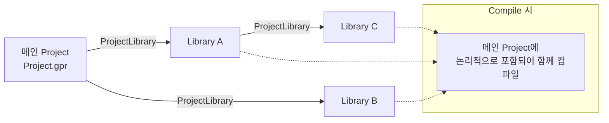

# Project.gpr — GPL 프로젝트 파일 형식

GPL 프로젝트 폴더에 반드시 있어야 하는 매니페스트 파일 `Project.gpr`의 형식 메모.

Brooks 공식 문서는 이 파일의 **개념**만 설명하고 **키워드 문법은 문서화하지 않는다**(2026-08-31 확인:
GDS·Controller Software 문서 어디에도 `ProjectBegin` 등의 리터럴이 등장하지 않음). 따라서 아래 문법은
실제 파일 관측과 이 저장소의 구현이 근거다.

각 항목의 근거 등급을 함께 표기한다:

| 표기 | 뜻 |
| --- | --- |
| **[실측]** | 실제 `.gpr` 파일 또는 제어기 응답으로 확인 |
| **[문서]** | Brooks 공식 문서의 서술 (실기기 검증 별도 필요) |
| **[미검증]** | 제보·추정. 실제 파일로 확인하기 전까지 단정하지 않는다 |

---

## 1. 위치와 역할

- **[문서]** `Project.gpr`는 각 프로젝트 폴더에 **항상 존재해야** 하며 "Project File"이라 부른다.
- **[문서]** 프로젝트에 속한 다른 파일들의 목록과, 실행 시작 프로시저 이름을 담은 **매니페스트**다.
- **[문서]** GDS가 내용을 자동 관리하므로 GDS 안에서는 보통 감춰져 있으나, **텍스트 편집기로 열람 가능**하다.
- **[문서]** 프로젝트를 메모리에 올려 실행하면 GPL이 **`Project.gpr`를 가장 먼저 읽는다**.
- **[문서]** 폴더 이름과 프로젝트 이름은 동의어다. 제어기 플래시에서는 `/flash/projects/` 아래에 놓인다.
  (이 확장의 FTP 배포 경로는 `/GPL/<ProjectName>` — `src/controller/deployService.ts` 참조.)

## 2. 최소 형식 **[실측]**

```gpr
ProjectBegin
ProjectName="MyProject"
ProjectStart="Main"
ProjectSource="MyProject.gpl"
ProjectEnd
```

GDE가 저장한 실제 파일은 첫 줄에 타임스탬프 주석이 붙는다(2026-08-28, MergeCode 65파일 관측):

```gpr
'08/28/2026, 03:58:19 PM
ProjectBegin
ProjectName="MergeCode"
ProjectStart="Main"
ProjectSource="__init__IOConfig__.gpl"
ProjectSource="T1\T1.gpl"
ProjectSource="T1\T2\T2.gpl"
ProjectEnd
```

- **[실측]** 인코딩은 ASCII/UTF-8, **BOM 없음**. 줄바꿈은 파일마다 다를 수 있다(LF 관측).
- **[실측]** `ProjectSource`는 `.gpr` 폴더 기준 **상대 경로**이며 **임의 깊이의 하위 폴더**를 가질 수 있다.
  GDE가 쓰는 구분자는 `\`.
- **[실측]** `.gpo`(전역 Location/Profile 파일)는 관측된 파일에서 `ProjectSource` 목록에 **포함되지 않았다**.

## 3. 키워드

| 키워드 | 형식 | 개수 | 근거 |
| --- | --- | --- | --- |
| `'MM/DD/YYYY, HH:MM:SS AM\|PM` | 첫 줄 주석(GDE 저장 시각) | 0~1 | **[실측]** |
| `ProjectBegin` | 값 없음, 블록 시작 | 1 | **[실측]** |
| `ProjectName` | `ProjectName="이름"` | 1 | **[실측]** |
| `ProjectStart` | `ProjectStart="프로시저명"` | 1 | **[실측]** |
| `ProjectSource` | `ProjectSource="상대경로"` | 0..N (파일당 한 줄) | **[실측]** |
| `ProjectLibrary` | `ProjectLibrary="상대\경로"` | 0..N | **[실측]** 2026-08-31 — §4 |
| `ProjectEnd` | 값 없음, 블록 끝 | 1 | **[실측]** |

파싱 시 알려진 관용:

- **[실측]** 값은 큰따옴표로 감싼다. 이 저장소의 파서는 작은따옴표도 허용하고 키워드 대소문자를 무시한다
  (`src/controller/gprSync.ts`의 `SOURCE_RE`).
- **[문서]** `ProjectStart`가 가리키는 프로시저는 **`Public`으로 선언되어야** 한다.
- 순서 규칙·중복 허용 여부·주석 문법(첫 줄 외 위치의 `'`)은 **문서화되어 있지 않다**. 확장은 알 수 없는 줄을
  **그대로 보존**하는 방식으로 대응한다(`applyGprSync`).

## 4. `ProjectLibrary` — 라이브러리 프로젝트

키워드와 값 형식은 **[실측]**(2026-08-31, GDS가 저장한 실제 `Project.gpr`). 값이 **단순 프로젝트명이
아니라 `\` 구분 경로**라는 것이 핵심이다.

```txt
projects/MyProject/Project.gpr        ProjectLibrary="MyProject\MyLibrary"
projects/MyProject/MyProject.gpl      Main() 에서 라이브러리의 T1() 호출
projects/MyProject/MyLibrary/Project.gpr   ← 중첩 프로젝트(자기 .gpr·자기 ProjectName)
projects/MyProject/MyLibrary/Project.gpl   Public Sub T1()
```

관측된 사실:

- 값 `MyProject\MyLibrary`는 **projects 루트 기준 상대 경로**다(프로젝트 폴더 기준이면 `MyLibrary`였을 것).
  단, 표본이 하나뿐이라 확장은 두 기준을 **후보 순서대로 모두 시도**한다
  (`src/project/projectSources.ts` `resolveProjectLibraryDirs`).
- 라이브러리는 **메인 프로젝트 폴더 안에 중첩**될 수 있다. 즉 "프로젝트 폴더 = 프로젝트 하나"가 아니다.
- 라이브러리의 `.gpr`에는 `ProjectStart`가 없어도 된다(관측된 `MyLibrary/Project.gpr`에는 없다).

**[미검증]** 라이브러리를 2개 이상 참조할 때 줄이 반복되는지(vs. 한 줄 콤마 구분) — §8.

GDS 문서 "GPL Project Libraries" 절의 서술:

- **[문서]** 어떤 프로젝트든 다른 GPL 프로젝트를 **라이브러리로 참조**해 그 `Public` 루틴·데이터를 쓸 수 있다.
  라이브러리로 만들기 위한 별도 변환 작업은 없다 — **아무 프로젝트나 라이브러리가 될 수 있다**.
- **[문서]** 참조를 추가하는 방법은 "GDS의 Project Window에서 **라이브러리 이름을 메인 프로젝트의
  Project File에 추가**"다.
- **[문서]** 메인 프로젝트는 **여러 라이브러리**를 참조할 수 있고, **라이브러리가 다른 라이브러리를 참조**할 수도 있다.



컴파일·메모리 의미 **[문서]**:

- 컴파일하면 참조된 라이브러리의 **모든 파일이 메인 프로젝트에 논리적으로 포함**되어 함께 컴파일된다
  (Project File List에 직접 적힌 것과 동일하게 취급).
- 서로 다른 두 메인 프로젝트가 같은 라이브러리를 참조하면 **각각 따로 컴파일**된다. 따라서:
  - 라이브러리를 공유해도 **메모리가 절약되지 않는다**.
  - 라이브러리의 **전역 변수는 메인 프로젝트마다 별도로 할당**된다 → **전역 변수로 프로젝트 간 데이터 공유 불가**.

로드/언로드 의미 **[문서]** — 배포 자동화에 직접 영향:

- **플래시에서** 메인 프로젝트를 로드하면 참조 라이브러리가 **자동으로 함께 로드**된다. 이미 로드돼 있으면 그것을 쓴다.
- **PC에서** 메인 프로젝트를 로드하면 라이브러리는 **수동으로 따로 로드해야 한다**.
- 개발 중 PC에서 라이브러리를 로드했다면 **플래시의 동명 라이브러리는 무시**된다.
- 메인 프로젝트를 **Unload해도 참조 라이브러리는 언로드되지 않는다**.

## 5. 프로젝트·파일 이름 규칙 **[문서]**

- 프로젝트 이름은 GPL 심볼 이름 규칙을 따른다: **영문자 또는 `_`로 시작**, 이후 영숫자와 `_` 조합,
  **단일 `_` 하나만인 이름은 불가**.
- 플래시 디스크에 저장되므로 **최대 43자**.
- 플래시 이름은 **대소문자를 구분**하므로, 문서가 권하는 관례는 "첫 글자만 대문자, 나머지는 소문자"
  (예: `Test_project`).
  - ※ **[실측] 실제로는 이 관례가 강제되지 않는다** — `MergeCode`, `TEST_GPL` 같은 이름이 실제로 쓰인다.
    문서의 권장 표기일 뿐 제어기가 거부하지는 않는 것으로 보인다.
- GDS는 파일명의 금지 문자(예: `-`)를 `_`로, 대문자를 소문자로 **자동 변경**한다.
- 위와 별개로, 이 확장은 **공백·제어 문자**를 별도로 차단한다 — 1402 콘솔 명령
  (`Compile`/`Load`/`Start`/`Unload`)은 인자를 공백으로 구분하고 인용 문법이 없기 때문
  (`src/controller/projectNameGuard.ts`).

## 6. 프로젝트에 들어가는 파일 종류 **[문서]**

| 확장자 | 내용 |
| --- | --- |
| `.gpr` | Project File(매니페스트). 폴더당 1개 필수 |
| `.gpl` | GPL 소스. 파일 하나에 모듈 여러 개 가능 |
| `.gpo` | 전역 모듈 — 전역 `Location`/`Profile` 정의용. 티칭한 로봇 위치 보관에 적합. 0~N개 |
| `.gpp` | **암호로 보호된 `.gpl`**. 열람·편집에 암호 필요, 실행은 누구나 가능 |
| `.gsq` | **GP Flow 시퀀스 파일**. 코딩 없이 고수준 명령 시퀀스를 만들고 Generate 하면 GPL 코드를 생성 |

`.gpp` 보호(Protect/Unprotect)는 **PC에 저장된 프로젝트의 개별 파일에만** 적용할 수 있고 프로젝트 전체에는
불가하다. 보호 후 제어기 Flash/Memory로 전송할 수 있다. 암호를 잊으면 복구할 수 없다.

## 7. 이 확장의 현재 대응 상태 (2026-08-31)

| 항목 | 상태 | 위치 |
| --- | --- | --- |
| `ProjectName`/`ProjectStart`/`ProjectSource` 파싱 | 지원 | `src/controller/gprSync.ts`, `src/controller/responseParser.ts` |
| 하위 폴더 상대 경로(`T1\T2\T2.gpl`) | 지원 | `src/project/projectSources.ts` |
| 첫 줄 타임스탬프 주석 보존·갱신 | 지원 | `formatGprTimestamp` |
| 알 수 없는 줄 보존 | 지원 | `applyGprSync` (매칭 안 되는 줄은 그대로 통과) |
| `ProjectLibrary` 인식 | 지원 | `parseGprText().libraries` / `parseGpr().libraries` — 동기화 대상이 아니며 그대로 보존 |
| 중첩 프로젝트 경계 | 지원 | `listSourceFilesRecursive({ stopAtNestedProject })` — 하위 폴더의 별도 `.gpr`에서 멈춘다 |
| 라이브러리 경로 해석(재귀·순환 방지) | 지원 | `resolveProjectLibraryDirs` — 프로젝트 폴더 기준 → projects 루트 기준 → 알려진 `.gpr` 폴백 |
| 심볼·참조 범위의 라이브러리 확장 | 지원 | `collectRelatedGprPaths` — 참조하는 라이브러리 + **자기를 참조하는 프로젝트**(역방향) |
| 디버그 소스 매핑·BP 표기 | 지원 | `_updateProjectDirs`가 라이브러리 폴더·소스를 프로젝트 범위에 포함 |
| 라이브러리 프로젝트 업로드/로드 | **미지원(경고만)** | 배포 대상은 메인 프로젝트 폴더 하나. 폴더 밖 라이브러리는 trace에 "포함되지 않음" 경고 |
| `.gpp`/`.gsq` | **미지원** | `PROJECT_SOURCE_EXTENSIONS`는 `.gpl`/`.gpo`/`.gpr`, 소스 스캔 기본은 `.gpl`만 |

후속 검토 후보(구현 결정 전, 근거 확인 필요):

1. 배포 시 참조 라이브러리 처리 — **PC에서 로드하면 라이브러리를 수동 로드해야 한다**는 문서 서술이 사실이면,
   FTP 배포 후 `Compile`이 라이브러리를 못 찾아 실패할 수 있다. **실기기 확인 전까지 배포 범위는 넓히지 않는다**
   (제어기 쪽 라이브러리 배치 규칙 — `/GPL/<메인>/<라이브러리>`인지 `/GPL/<라이브러리>`인지 — 이 미확인).
2. `.gpp`(암호 보호)는 내용을 읽을 수 없으므로 **소스로 스캔하되 파싱 실패를 정상으로 취급**하는 처리가 필요할 수 있다.
3. 라이브러리 프로젝트를 QuickPick에서 표시만 하고 있다 — Start 대상으로 고르면 `ProjectStart`가 없어 실패한다.
   미리 막을지(경고/비활성) 결정 필요.

## 8. 검증 방법

**완료(2026-08-31)** — 사용자가 GDS로 `projects/MyProject`를 만들어 라이브러리를 추가했고, 저장된
`Project.gpr`에서 `ProjectLibrary="MyProject\MyLibrary"`를 확인했다. §3·§4의 표기를 **[실측]**으로 갱신했다.

남은 확인 항목:

1. 라이브러리를 **2개 이상** 추가해 줄이 반복되는지(vs. 콤마 구분 한 줄인지) 확인한다.
2. 라이브러리를 참조하는 프로젝트를 FTP로 올린 뒤 `Compile`을 보내 `<STATUS>`를 확인한다.
   특히 **제어기에서 라이브러리가 어디 있어야 하는지** — `/GPL/<메인>/<라이브러리>`(중첩 그대로)인지
   `/GPL/<라이브러리>`(별도 로드)인지. 라이브러리 미로드 시의 상태 코드도 기록한다.
3. 라이브러리 소스에 브레이크포인트를 걸어 `Set Break <메인프로젝트> "<파일>"<줄>`이 통하는지
   (파일 표기가 basename인지 메인 프로젝트 기준 상대 경로인지).

## 9. 출처

- [GPL Projects Overview (GDS)](https://www2.brooksautomation.com/GDS/Guidance_Development_Environment/gpl_projects.htm)
  — 파일 종류, 이름 규칙, GPL Project Libraries
- [GPL Projects Window (GDS)](https://www2.brooksautomation.com/GDS/Guidance_Development_Environment/GDE_Windows/gds_project_window.htm)
  — Project Properties, Protect/Unprotect, 라이브러리 컴파일·로드 서술
- [Projects and Files (Controller Software)](https://www2.brooksautomation.com/Controller_Software/Introduction_To_The_Software/Guidance_Programming_Language/managingprojects.htm)
  — 프로젝트 실행 절차(Load → Compile → Start), 모듈 규칙
- 실제 파일 관측: `MergeCode`(65파일, 2026-08-28), `TEST_GPL`, `samples/hello-project/Project.gpr`
